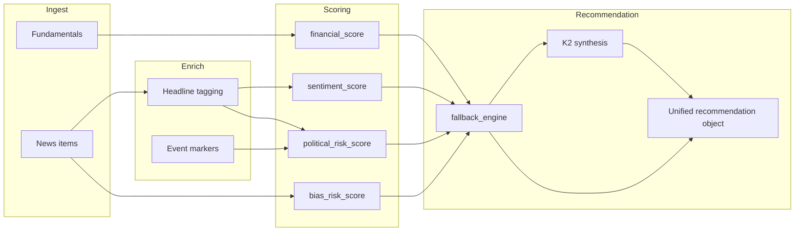

# Signal — AI layer specification (Harper + Polymarket-ready)

## 1. Understanding (confirmed)

- **Product:** An AI investment *decision agent* that outputs **Invest / Risky / Avoid**, **reasoning**, **risk factors**, **headlines**, and **explainable 0–100 scores**—not price targets.
- **Data:** Fundamentals (FMP/Finnhub + mock), news (Finnhub → NewsAPI → mock), optional `outlet_leaning`, stub sentiment, source-diversity bias.
- **Models:** **K2** for structured recommendation JSON synthesis; **Hermes** for grounded chat; **deterministic fallback** when keys or parsing fail.
- **Differentiation:** Surface **public perception** and **political/regulatory** narrative risk as first-class signals beside fundamentals.
- **Tracks:** Harper = personal workflow assistant; Polymarket = structured uncertainty / event reasoning (extension path below).

---

## 2. AI pipeline architecture

High-level flow: **fetch → enrich → score → (optional) K2 merge → persist → serve**.



**Modules (target layout in `backend/app/services/`):**

| Step | Module | Responsibility |
|------|--------|----------------|
| Tagging | `ai/tagging.py` | Regex/keyword tags per headline; `event_tags`, `political_risk_tags` |
| Events | `ai/events.py` | Build `events[]` for charts (timestamp, kind, severity) |
| Scores | `ai/scores.py` | Four `ComponentScore` structs from metrics + enriched news |
| Fallback | `ai/fallback_engine.py` | Weighted composite → label + confidence + drivers |
| K2 | `ai_k2.py` (extend) | Call model with scores + headlines; parse JSON; on failure use fallback |
| Chat | `ai_hermes.py` (extend) | Inject analysis snapshot + user question |

Reference implementations live in **`AI/stubs/`** until merged into `backend`.

---

## 3. Proposed `/analyze` response schema

**Strategy:** Evolve current `AnalyzeResponse` with additive fields to avoid breaking the demo.

1. **Phase A (fast):** Add `scores`, `events`, enrich `news.items[]` with tags; keep `recommendation.verdict` and map new `recommendation.label` ↔ `verdict` for the frontend.
2. **Phase B:** Frontend switches to `recommendation.label`, `top_headlines`, `score_breakdown`.

Normative JSON Schema: [schemas/analyze_response.proposed.json](./schemas/analyze_response.proposed.json).

**Top-level additions:**

- `scores`: `{ financial, sentiment, bias_risk, political_risk }` each a **component score** (see §4).
- `events`: array of **timeline markers** for perception/regulatory shocks.
- `recommendation`: extend with `summary_reasoning`, `bull_case`, `bear_case`, `key_drivers`, `key_risks`, `top_headlines`, `score_breakdown`, `trail` (`engine`: `k2` | `fallback`).
- `prediction_stub` (optional): placeholder for Polymarket-style reasoning (§8).

---

## 4. Four main component scores (0–100)

All scores expose: `score_0_100`, `label`, `rationale`, `confidence` (0–1), `quality` (`high` | `medium` | `low`).

### 4.1 `financial_score` — “How resilient / reasonably valued vs. available fundamentals?”

**Direction:** Higher = **better** fundamentals snapshot (for long-bias demo).

| Signal | Heuristic |
|--------|-----------|
| PE | If `pe_ratio` ∈ [8, 28] → base 70; if &lt; 0 or &gt; 45 → cap at 40; linear taper between bands |
| Debt | If `debt_to_equity` null → quality↓; if &lt; 0.6 → +10 cap; if &gt; 2 → −15 |
| Scale | If `market_cap_usd` present and &gt; 5B → +5 (liquidity / coverage proxy); else 0 |
| Missing data | If ≥2 of 4 metrics missing → `quality=low`, `confidence` *= 0.7 |

**Labels:** `strong` (≥72), `mixed` (45–71), `weak` (&lt;45).

**Rationale template:** one sentence naming PE band + debt if known + data completeness.

### 4.2 `sentiment_score` — “What tone do recent headlines skew?”

Map existing aggregate `avg` in [-1, 1] to 0–100: `round(50 + 50 * clamp(avg, -1, 1))`.

| Field | Definition |
|-------|------------|
| `spread` | Stdev of per-headline polarity (or range max−min); high spread → lower `confidence` |
| `confidence` | `1.0 - min(0.5, spread)` × headline count factor: `min(1, n/8)` |

**Labels:** `bullish` (≥62), `mixed` (38–61), `weak` (&lt;38).

### 4.3 `bias_risk_score` — “How much would a one-sided media lens distort perception?”

**Direction:** Higher = **more risk** (worse) from narrative concentration / partisan clustering.

| Rule | Points (toward 100 = high risk) |
|------|----------------------------------|
| Distinct sources | 1 source → +40, 2 → +25, 3 → +15, 4+ → +5 |
| `outlet_leaning` known | If ≥70% headlines same leaning (L/R) → +20 |
| Unknown leaning | no penalty (neutral) |

**Labels:** `high` (≥65), `moderate` (35–64), `low` (&lt;35).

**Rationale:** “N outlets; narrative concentration …”

### 4.4 `political_risk_score` — “Regulation, geopolitics, executive controversy, policy?”

**Direction:** Higher = **more** regulatory/perception tail risk.

1. Tag each headline with categories from keyword lists (regulation, election, tariff, antitrust, executive, sanctions, macro, controversy).  
2. `raw_hits` = weighted count (controversy/antitrust/sanctions weight 1.2; others 1.0).  
3. `score_0_100` = `min(100, 18 * raw_hits)` with floor 0 if no hits.

**Labels:** `elevated` (≥55), `moderate` (20–54), `low` (&lt;20).

**Confidence:** High if ≥8 headlines; medium if 4–7; low if &lt;4.

---

## 5. Deterministic fallback recommendation

**Purpose:** Always return a coherent label when K2 fails or keys are missing; K2 should *refine*, not replace, traceability.

### 5.1 Weighted composite

Define helpers:

- `F` = `financial_score` (higher better)
- `S` = `sentiment_score` (higher better)
- `B` = `bias_risk_score` (higher worse) → use `B' = 100 - B`
- `P` = `political_risk_score` (higher worse) → use `P' = 100 - P`

**Composite (0–100):**

`C = 0.35*F + 0.25*S + 0.20*B' + 0.20*P'`

### 5.2 Label thresholds

| `C` | Label |
|-----|-------|
| ≥ 62 | Invest |
| 42–61 | Risky |
| &lt; 42 | Avoid |

**Guards (bump to Risky minimum):**

- If `political_risk_score ≥ 60` and `C ≥ 62` → **Risky** (policy tail risk).
- If `bias_risk_score ≥ 70` → cap effective `C` at 58 (narrative uncertainty).

**Confidence:** `base = |C - 50| / 50` capped [0.35, 0.85], then multiply by min of component `confidence` values.

**key_drivers:** Top 2 contributing terms by absolute deviation from 50 (e.g. “Political risk elevated”, “Fundamentals solid”).

**Implementation:** See [stubs/fallback_engine.py](./stubs/fallback_engine.py).

---

## 6. K2 & Hermes prompts

- **K2:** [prompts/k2_recommendation.md](./prompts/k2_recommendation.md)  
- **Hermes:** [prompts/hermes_chat.md](./prompts/hermes_chat.md)

**Merge policy:** Always compute deterministic scores + fallback first; pass them as `fallback_preview` into K2; if JSON parse fails, return fallback payload with `trail.engine=fallback`.

---

## 7. Political / perception layer

### 7.1 Headline & event tagging

- **Tags** (string enums): `regulation`, `election`, `tariff`, `antitrust`, `executive`, `sanctions`, `macro`, `controversy`, `legal`, `labor`, `other`.
- **Implementation:** Keyword + phrase lists (case-insensitive); optional second pass with tiny local LLM later—**not** required for hackathon.

### 7.2 Timeline `events[]`

For each tagged headline with severity:

- `t` = `published_at` or analysis time  
- `kind` = primary tag bucket  
- `severity_0_100` = f(tag, keyword strength)  
- `source_headline_index` = index in `news.items`

Frontend: overlay markers on sentiment or “composite score” sparkline.

### 7.3 Controversy / narrative

If multiple outlets tag `controversy` or `executive` within 48h window → add synthetic `event` “Cluster: leadership / ethics narrative” for demo clarity.

---

## 8. Polymarket / future extension (no integration yet)

**Add optional `prediction_stub`:**

```json
{
  "event_hypothesis": "string describing resolved or hypothetical event",
  "implied_direction": "bullish | bearish | uncertain",
  "confidence_language": "low | medium | high",
  "scenarios": [
    { "name": "Base", "narrative": "...", "score_delta": 0 },
    { "name": "Reg shock", "narrative": "...", "score_delta": -15 }
  ]
}
```

**Future wiring:** Given a market id or question text, fetch order book / implied prob off-chain; feed as *one more* structured block into K2 (“market believes X at ~Y%—compare to our `political_risk_score`”). Keepadapter in `services/polymarket_client.py` (stub only).

---

## 9. Files to create or modify

### Create (backend)

| Path | Role |
|------|------|
| `app/services/ai/__init__.py` | Package |
| `app/services/ai/tagging.py` | Headline tags |
| `app/services/ai/events.py` | `events[]` builder |
| `app/services/ai/scores.py` | Four component scores |
| `app/services/ai/fallback_engine.py` | Weighted recommendation |
| `app/services/ai/types.py` | Shared dataclasses / Pydantic mirrors |

### Modify (backend)

| Path | Change |
|------|--------|
| `app/schemas/analyze.py` | Add `ComponentScore`, `ScoreBundle`, extend `NewsItemOut`, `RecommendationOut`, root response |
| `app/services/analysis_service.py` | Call tagging → scores → fallback → K2 |
| `app/services/ai_k2.py` | New prompt payload; map response to extended recommendation; fallback on error |
| `app/services/ai_hermes.py` | Inject full analysis snapshot in system/user |
| `app/services/sentiment_stub.py` | Optional: per-headline scores for spread |
| `app/db/repositories.py` | Persist new fields if Mongo schema is strict |

### Modify (frontend, when ready)

| Path | Change |
|------|--------|
| `frontend/lib/analyzeTypes.ts` | Mirror new fields |
| `frontend/lib/mapAnalyzeResponse.ts` | Map scores + events to UI |
| Analysis charts | Plot `events[]` |

### This repo folder

| Path | Role |
|------|------|
| `AI/README.md` | Entry point |
| `AI/SIGNAL_AI_SPEC.md` | This document |
| `AI/schemas/*.json` | Contract |
| `AI/prompts/*.md` | Prompts |
| `AI/stubs/*.py` | Reference code |

---

## 10. Success criteria (demo)

- Two tickers side-by-side show **different** `political_risk_score` when one has regulatory headlines.
- Turning off API keys still yields **sensible** Invest/Risky/Avoid via fallback.
- Chat answers **only** from stored analysis JSON.
